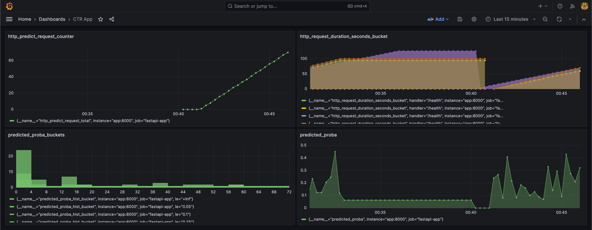

ctr_project
==============================

В мире онлайн-рекламы кликабельность (Click-Through Rate или CTR) является очень важной метрикой для оценки эффективности рекламы. 
В связи с этим, системы предсказания кликов имеют большое значение и широко используются для спонсорского поиска 
и ставок в режиме реального времени (real time bidding).

В данном проекте мы построим production-ready пайплайн по предсказанию кликов пользователя для мобильной Web рекламы.
За основу возьмем данные соревнования Kaggle [Avazu CTR Prediction](https://www.kaggle.com/competitions/avazu-ctr-prediction/overview/description).


## Sem2. ML Pipeline
### Описание пайплайна
Пайплайн с моделью состоит из трех основных элементов
- `make_dataset`: чтения данных
- `features/build_transformers`: обработки признаков, в которую входят
  - `DeviceCountTransformer`, `UserCountTransformer`: трансформы для расчета количества 
рекламных объявлений на пользователя или девайс
  - `CtrTransformer`: трансформы, с помощью которых кодируем категориальные переменные средним CTR
- `model_fit_predict`: обучаем классическую модель `Catboost` `а на предсказание вероятности клика для данной сессии пользователя. 

Поскольку целью данного курса являются не сами эксперименты или файнтюнинг модели, а построение пайплайна
то будем исходить из предположения, что это некоторая готовая версия модели, и нас просят катить ее в прод.
Поэтому мы сосредоточим усилия на воспроизводимости, поддерживаемости, развертке и мониторинге.


### Установка 
```bash
python -m venv .venv
source .venv/bin/activate
pip install -r requirements.txt
```

### Обучение модели
```bash
python ctr_project/train_pipeline.py --configs configs/train_config.yaml
```

### Юнит тестирование:
```bash
pytest
```

### Результаты
Наш пайплайн будет достаточно прямолинейным и будет содержать элементы описанные ранее.
Кастомные обработки фичей обернуты в формат `sklearn transformer` для единооборазия.


## Sem3. Reproducibility
В этом занятии мы затроним вопрос воспроизводимости экспериментов в ML. 
Рассмотрим 2 инструмента воспроизводимости экспериментов над моделями:
- [DVC](https://dvc.org/) : для версионирования данных и артефактов при помощи Git синтаксиса
- [MLFlow](https://mlflow.org/): для логирования экспериментов над моделью.

Также поднимем удаленное S3 объектное хранилище в VK Cloud.

### Установка 
```bash
pip install dvc
pip install mlflow
```

### Основные команды
В процессе занятия нам потребуются следующие команды для настройка MLFLow UI и DVC и
добавления данных в удаленное хранилище.
```bash
mlflow ui

# setup DVC
dvc init
dvc add data/raw/sampled_train_5m.csv
dvc add data/raw/sampled_train_50k.csv

# create and setup remote
dvc remote add s3 s3://sem3-repro/ctr-project-train/
dvc remote modify s3 endpointurl https://hb.ru-msk.vkcs.cloud 
dvc remote modify s3 region ru-msk

# push/ pull to remote
dvc push -r s3
dvc pull -r s3

dvc repro
```

### Результаты
После прогона пайплайн у нас должна залогироваться их история в списке экспериметнов.


В каждом эксперименте будет записан свой список метрик, параметров модели и артефактов.


Мы будем иметь возможность сравнивать между собой отдельные запуски для выбора наиболее оптимального.


При этом в удаленном хранилище будут записаны обучающие данные, `.pkl` модели и `.json` метрики. 
Артефакты с каждого прогона сохранены под своим собственным `md5` хэшом.


При этом `md5` хэши для каждого эксперимента будут доступны в файле `dvc.lock`, который обновляется после каждого нового
эксперимента. Его мы тоже логируем в MLFlow, что дает нам возможность всегда иметь ссылку на состояние пайплайна
в каждом эксперименте.

```
schema: '2.0'  
stages:  
  train:  
    cmd: python train_pipeline.py --config configs/train_config.yaml  
    deps:  
    - path: configs/train_config.yaml  
      hash: md5  
      md5: 37cbcef657312c588f872fae924d1c26  
      size: 969  
    - path: data/raw/  
      hash: md5  
      md5: 75f77c6ca378b83b4d199c58e68d213f.dir  
      size: 1762301353  
      nfiles: 8  
    outs:  
    - path: models/catclf.pkl  
      hash: md5  
      md5: bef120e799a37fc607c97ec475285368  
      size: 37030  
    - path: models/metrics.json  
      hash: md5  
      md5: 7cac56ee734d1e973b3a13c392cd15e8  
      size: 167
```


## Sem4. Inference
В этом занятии мы рассмотрим, как обернуть обученную ранее модель в REST сервис. 
Для этого нам познакомимся с [Fast API](https://fastapi.tiangolo.com/). 
Также сделаем сервис доступным для запуска с любой машины, для этого мы соберем [Docker](https://www.docker.com/) образ
и запустим его локально. Далее поднимем виртуальную машину на [VKCLoud](https://mcs.mail.ru/)
и развернем сервис удаленно.


### Установка 
```bash
pip install fastapi
pip install unicorn
apt install docker.io
```

### Основные команды
```bash
# run uvicron server
uvicorn app:app --host 0.0.0.0 --port 8000

# build docker image
docker build -t evgeniimunin/ctr_online_inference:v1 .

# run fastapi app in docker container
docker run -p 8000:8000 evgeniimunin/ctr_online_inference:v1

# generate inference data on client side
python src/inference/make_requests.py

# push docker image to dcoker hub
docker tag evgeniimunin/ctr_online_inference:v1 evgeniimunin/ctr_online_inference:v1
docker push evgeniimunin/ctr_online_inference:v1
```

### Основные команды для запуска сервиса с удаленной машины
```bash
# resrict rights for .pem key pair VM access file
chmod 400 your_key_pair.pem

# connect to VM by SSH
ssh -i your_key_pair.pem ubuntu@your_external_ip

# pull docker image from docker hub
docker pull evgeniimunin/ctr_online_inference:v1

# run fastapi app in docker container
docker run -p 8000:8000 evgeniimunin/ctr_online_inference:v1
```

### Результаты
После написания REST сервиса на FastAPI мы можем его протестировать, отправив запросы на инференс.
В качестве ответа мы получим код 200, означающий успешный ответ с сервера, а тело ответа будет содержать
`device_ip` и предсказанную вероятность клика для данной сессии `click_proba`.
```
response.status_code: 200
response.json(): [{'device_ip': '7061f023', 'click_proba': 0.2136}]
```


## Sem6. Monitoring
В этом занятии мы рассмотрим, как настроить мониторинг REST сервиса на инференсе. 
В качестве инструментов мы воспользуемся
- [Grafana](https://grafana.com/): инструмент для визуализации метрик
- [Prometheus](https://prometheus.io/): система мониторинга которая будет собирать метрики у приложения 
и передавать их в Grafana

### Установка
Для передачи метрик в Prometheus нам понадобятся библиотеки
- [prometheus-fastapi-instrumentator](https://github.com/trallnag/prometheus-fastapi-instrumentator), чтобы Prometheus знал endpoint `/metrics`, откуда забирать метрики.
- [prometheus-client](https://github.com/prometheus/client_python) для определения метрик.

В качестве метрик выведем:
- `predict_proba`: значение вероятности клика с каждого предсказания
- `predicted_proba_hist`: гистограмма вероятностей
- `http_predict_request_total`: счетчик входящих запросов на endpoint `/predict`

Для настройки Prometheus мы пропишем конфиг, 
где среди прочего укажем расписание сбора метрик по endpoint'у `localhost:8000/metrics`.

```yml
global:
  scrape_interval: 5s

scrape_configs:
  - job_name: 'prometheus'
    honor_timestamps: true
    scrape_interval: 5s
    scrape_timeout: 4s
    metrics_path: /metrics
    scheme: http
    follow_redirects: true
    static_configs:
      - targets:
        - localhost:9090

  - job_name: 'fastapi-app'
    scrape_interval: 5s
    metrics_path: /metrics
    static_configs:
      - targets: ['app:8000']
```

Для работы нам будет необходимо поднять docker образы приложения, Prometheus, grafana.
Делать мы это будем с помощью `docker-compose`.

```bash
docker compose up
```

### Результаты
После сборки образов и запуска контейнеров мы можем обратиться к серверу Prometheus 
по адресу `localhost:9090`. В поле выбора метрик 
мы сможем увидеть введенные нами метрики и их текущие занчения.


Далее по адресу `localhost:9090/targets` мы сможем проверить endpoint, 
с которого Prometheus забирает метрики и его статус UP.


Grafana будет доступна по адресу `localhost:3000`. После создания datasource Prometheus
мы сможем создать дашборд, куда и вынесем необходимые метрики.



## Организация проекта
```
    ├── LICENSE
    ├── Makefile           <- Makefile with commands like `make data` or `make train`
    ├── README.md          <- The top-level README for developers using this project.
    ├── data
    │   ├── external       <- Data from third party sources.
    │   ├── interim        <- Intermediate data that has been transformed.
    │   ├── processed      <- The final, canonical data sets for modeling.
    │   └── raw            <- The original, immutable data dump.
    │
    ├── docs               <- A default Sphinx project; see sphinx-doc.org for details
    │
    ├── models             <- Trained and serialized models, model predictions, or model summaries
    │
    ├── notebooks          <- Jupyter notebooks. Naming convention is a number (for ordering),
    │                         the creator's initials, and a short `-` delimited description, e.g.
    │                         `1.0-jqp-initial-data-exploration`.
    │
    ├── references         <- Data dictionaries, manuals, and all other explanatory materials.
    │
    ├── reports            <- Generated analysis as HTML, PDF, LaTeX, etc.
    │   └── figures        <- Generated graphics and figures to be used in reporting
    │
    ├── requirements.txt   <- The requirements file for reproducing the analysis environment, e.g.
    │                         generated with `pip freeze > requirements.txt`
    │
    ├── setup.py           <- makes project pip installable (pip install -e .) so src can be imported
    ├── src                <- Source code for use in this project.
    │   ├── __init__.py    <- Makes src a Python module
    │   │
    │   ├── data           <- Scripts to download or generate data
    │   │   └── make_dataset.py
    │   │
    │   ├── features       <- Scripts to turn raw data into features for modeling
    │   │   └── build_features.py
    │   │
    │   ├── models         <- Scripts to train models and then use trained models to make
    │   │   │                 predictions
    │   │   ├── predict_model.py
    │   │   └── train_model.py
    │   │
    │   └── visualization  <- Scripts to create exploratory and results oriented visualizations
    │       └── visualize.py
    │
    └── tox.ini            <- tox file with settings for running tox; see tox.readthedocs.io
```

<p><small>Project based on the <a target="_blank" href="https://drivendata.github.io/cookiecutter-data-science/">cookiecutter data science project template</a>. #cookiecutterdatascience</small></p>
